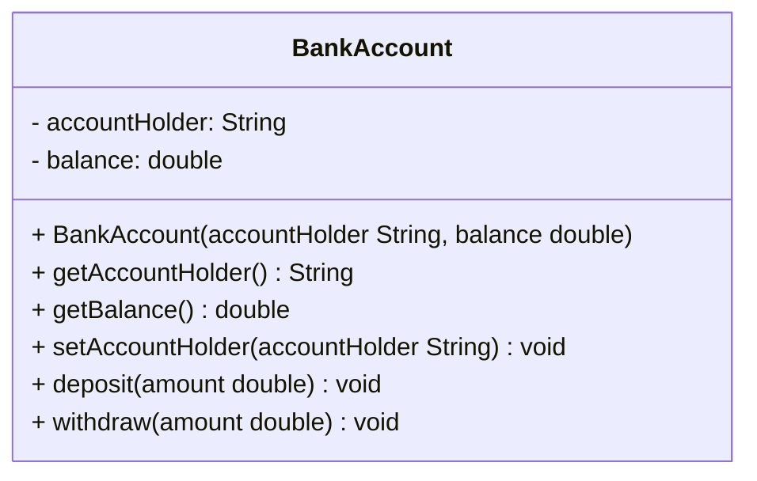
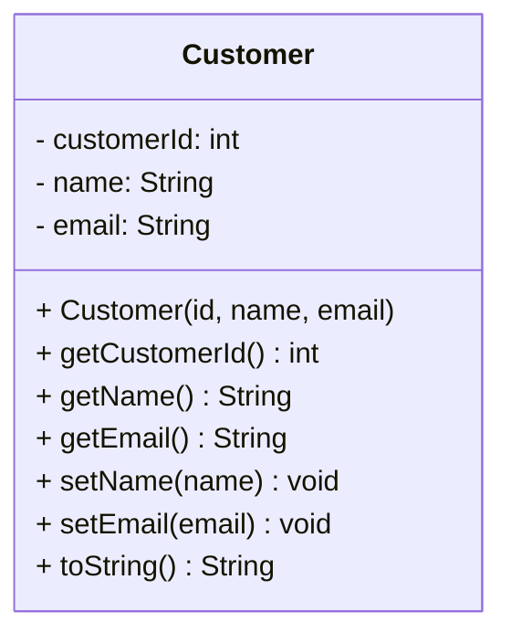
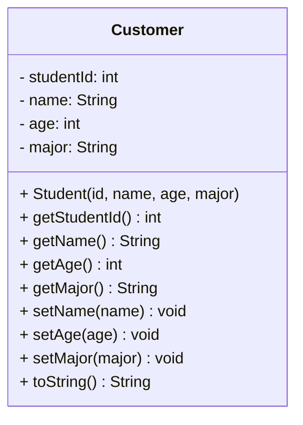
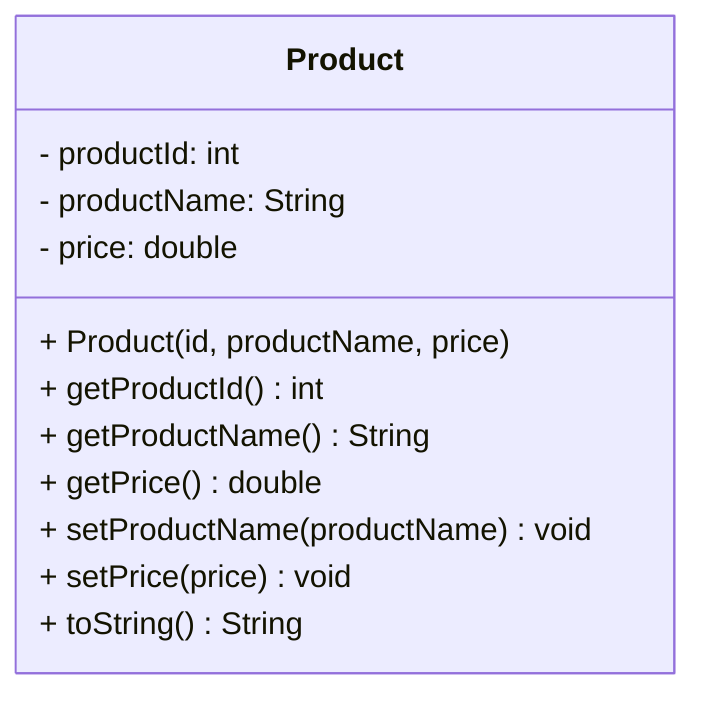

UML Class Diagrams
## Exercise 1: 💳 BankAccount

```mermaid
classDiagram
    class BankAccount {
        - accountHolder: String
        - balance: double
        + BankAccount(accountHolder String, balance double)
        + getAccountHolder() String
        + getBalance() double
        + setAccountHolder(accountHolder String) void
        + deposit(amount double) void
        + withdraw(amount double) void
    }
```

## Exercise 2: 🤵‍♀️🤵‍♂️ Customer

```mermaid
classDiagram
class Customer {
- customerId: int
- name: String
- email: String           
+ Customer(id, name, email) 
+ getCustomerId() int    
+ getName() String       
+ getEmail() String      
+ setName(name) void     
+ setEmail(email) void   
+ toString() String      
}
```

## Exercise 3: 👨‍🎓👩‍🎓 Student

```mermaid
classDiagram
class Customer {
- studentId: int          
- name: String            
- age: int                
- major: String           

+ Student(id, name, age, major) 
+ getStudentId() int     
+ getName() String       
+ getAge() int           
+ getMajor() String      
+ setName(name) void     
+ setAge(age) void       
+ setMajor(major) void   
+ toString() String
}
```

## Exercise 4: 🍲 Product

```mermaid
classDiagram
class Product {
 - productId: int
 - productName: String   
 - price: double         
 + Product( id, productName, price)  
 + getProductId() int               
 + getProductName() String          
 + getPrice() double                
 + setProductName(productName) void 
 + setPrice(price) void             
 + toString() String
}
```

